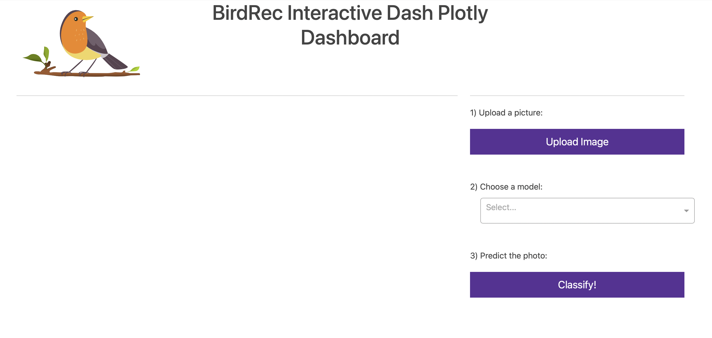
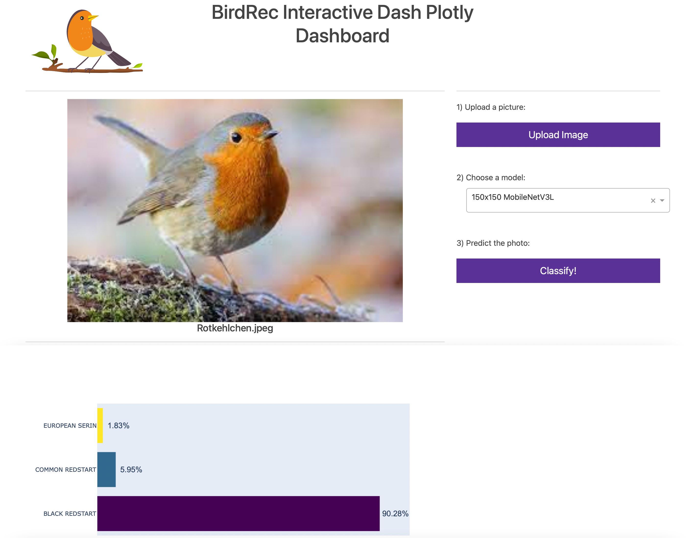

# Simple Dashboard to classify the bird species of an uploaded image

## Description

Assuming we have made a couple of nice photos with our Raspberry Pi Camera, we can now perform the classification using this dashboard. Just follow three simple steps:
- choose one image from your local computer
- select a model
- let the model predict the class for you and see the results below



After doing so, you will see sth. similar to this:



---
## Requirements and Environment

Requirements:
- pyenv with Python: 3.9.8

Environment: 

For setting up the virtual environment you can install it manually with the following commands: 

```Bash
pyenv local 3.9.8
python -m venv .venv
source .venv/bin/activate
pip install --upgrade pip
pip install -r requirements_dev.txt
```


## Getting started

After executing above commands, just run the dashboard with

` $ python app.py`


It might take 15s to load. The terminal will stop with:

```Bash
* Running on http://127.0.0.1:8050
```

Just copy the link and insert it to your browser.
